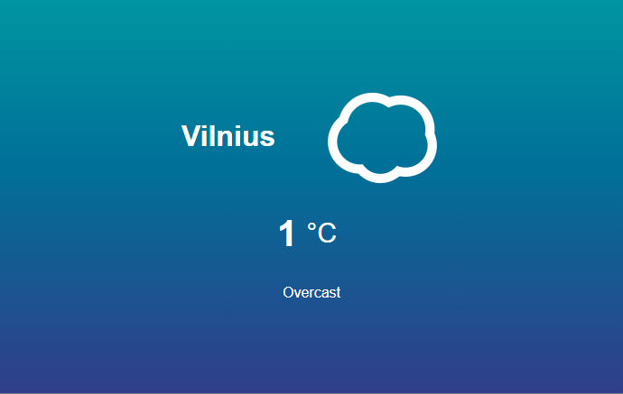

# WHATweather
Simple local weather app created with **JavaScript**

## About

- App is built using Vanilla JavaScript
- It uses DarkSky API to receive data about local weather using device's current location
- Animated wheater icons

Try it yourself:  https://mskirmantas.github.io/WHATweather/
